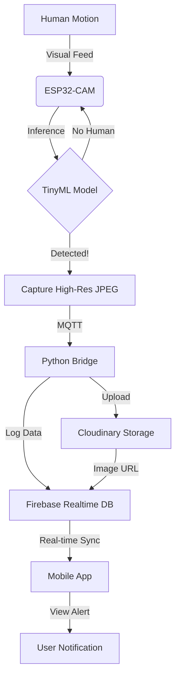

# 🦅 EagleEye: Intelligent Edge AI Surveillance System

[](https://github.com/muhammadAB123/fyp-eagle-eye)
[](https://espressif.com)
[](https://www.tensorflow.org/lite/microcontrollers)
[](https://firebase.google.com)
[](https://cloudinary.com)

**EagleEye** is a decentralized, privacy-focused surveillance system that processes video feeds **on the edge**. Using the ESP32-CAM and TinyML, it detects intruders locally and only transmits high-resolution evidence to the cloud when a threat is confirmed.

---

## 🏗️ System Architecture

EagleEye bridges the gap between low-power edge hardware and powerful cloud services.



### 1. The Edge Layer (`firmware/`)
*   **Hardware**: AI-Thinker ESP32-CAM.
*   **AI Model**: Custom-trained 48×48×1 greyscale INT8 CNN on device (`eagleeye-main`). An Edge Impulse RGB variant is archived under `models/` (see `models/MODEL_VERSIONS.md`).
*   **Logic**: Captures at QVGA (320×240), center-crops to 240×240 (no distortion), resizes to 48×48 for inference (~106ms). Upon detection, captures high-res color JPEG with flash and sends via MQTT.

### 2. The Cloud Gateway (`backend/`)
*   **Connectivity**: Connects local MQTT broker (Mosquitto) to the internet.
*   **Cloudinary**: Stores high-resolution images securely and provides optimized delivery URLs.
*   **Firebase**: Acts as the central nervous system, storing timestamps, alert types, and image URLs in a Realtime Database.
*   **Remote Control**: Listens for arm/disarm commands from the mobile app and relays to ESP32.

### 3. The Mobile Application (`mobile-app/`)
*   **Real-time Alerts**: Listens to Firebase and updates the UI instantly when an intrusion occurs.
*   **Dashboard**: System status, arm/disarm toggle, latest alert preview.
*   **Gallery View**: Browse through historical alerts with high-quality evidence images.
*   **Stats**: Intrusion statistics and analytics.
*   **Tech Stack**: Expo, React Native, Firebase SDK.

---

## 📁 Project Structure

```
fyp-eagle-eye/
├── firmware/              # ESP32-CAM firmware
│   ├── eagleeye-main/     # Active firmware (custom greyscale model)
│   └── tests/             # PIR sensor test sketches
├── backend/               # Python bridge + MQTT broker config
│   ├── bridge.py          # Main MQTT→Cloud bridge
│   ├── mosquitto.conf     # Local MQTT broker config
│   └── captures/          # Locally saved intrusion images
├── mobile-app/            # React Native (Expo) mobile app
│   └── src/               # Screens, components, config, hooks
├── models/                # Canonical .tflite archives + MODEL_VERSIONS.md
│   ├── model_v1.0_baseline.tflite
│   ├── model_v6.1_edge_impulse_grayscale.tflite  # EI project 1000575 (48×48 gray)
│   ├── model_v6.0_edge_impulse_final.tflite      # older RGB EI export
│   └── tflite_to_cpp_header.py
├── model-training/        # ML model training scripts
│   ├── train_tiny_model.py  # Active model training script
│   └── exported-models/   # Output .tflite models (incl. EI copy)
├── tools/edge_impulse/    # Upload / train / download from Edge Impulse Studio
├── datasets/              # Training datasets
├── docs/                  # Papers, presentations, diagrams
│   ├── presentations/
│   ├── papers/
│   └── assets/
├── _archive/              # Old/obsolete experiments
├── README.md
└── PROJECT_MANUAL_START.md
```

---

## 🚀 Getting Started

> **Quick start?** Check out the [Manual Start Guide](PROJECT_MANUAL_START.md) for step-by-step commands.

### Hardware Prerequisites
*   ESP32-CAM (AI-Thinker)
*   FTDI USB-to-TTL Adapter
*   5V 2A Power Supply

### Software Setup

#### 1. Firmware (ESP32)
1.  Open `firmware/eagleeye-main/eagleeye-main.ino` in Arduino IDE.
2.  Configure `secrets.h` with your WiFi and MQTT credentials.
3.  Flash using the AI Thinker ESP32-CAM board setting.

#### 2. Backend (Python Bridge)
1.  Enter the backend directory: `cd backend`.
2.  Install dependencies:
    ```bash
    pip install paho-mqtt firebase-admin cloudinary python-dotenv
    ```
3.  Configure `.env` with your Cloudinary and Firebase credentials.
4.  Start the MQTT broker: `mosquitto -c mosquitto.conf -v`
5.  Run the bridge: `python bridge.py`.

#### 3. Mobile App (Expo)
1.  Navigate to `mobile-app`.
2.  Install packages: `npm install`.
3.  Start the app: `npx expo start`.

---

## 🛠️ Tech Stack & Credits
*   **Edge AI**: TensorFlow Lite Micro (custom grayscale CNN + optional Edge Impulse classifier in `models/`)
*   **Communication**: Local MQTT via Mosquitto Broker
*   **Cloud**: Cloudinary (image storage) + Firebase Realtime Database
*   **Mobile**: React Native + Expo
*   **Hardware**: ESP32-CAM (AI-Thinker) with OV2640

---

## 📄 License
Detailed license information can be found in the [LICENSE](LICENSE) file. Developed as part of a Final Year Project (FYP).
