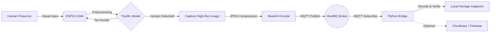
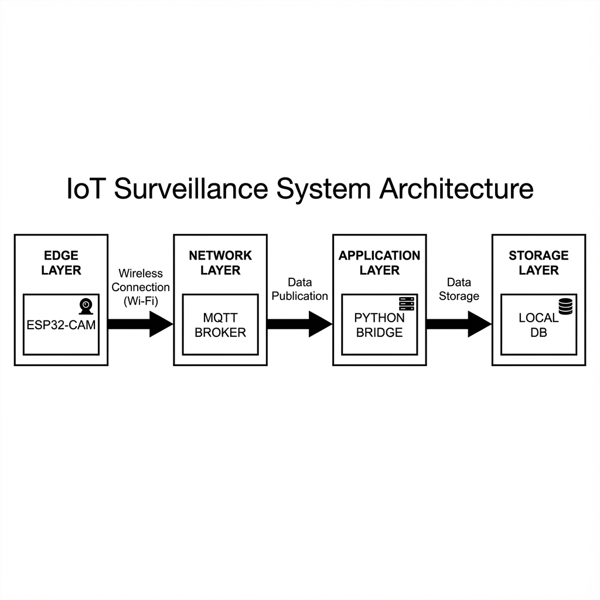
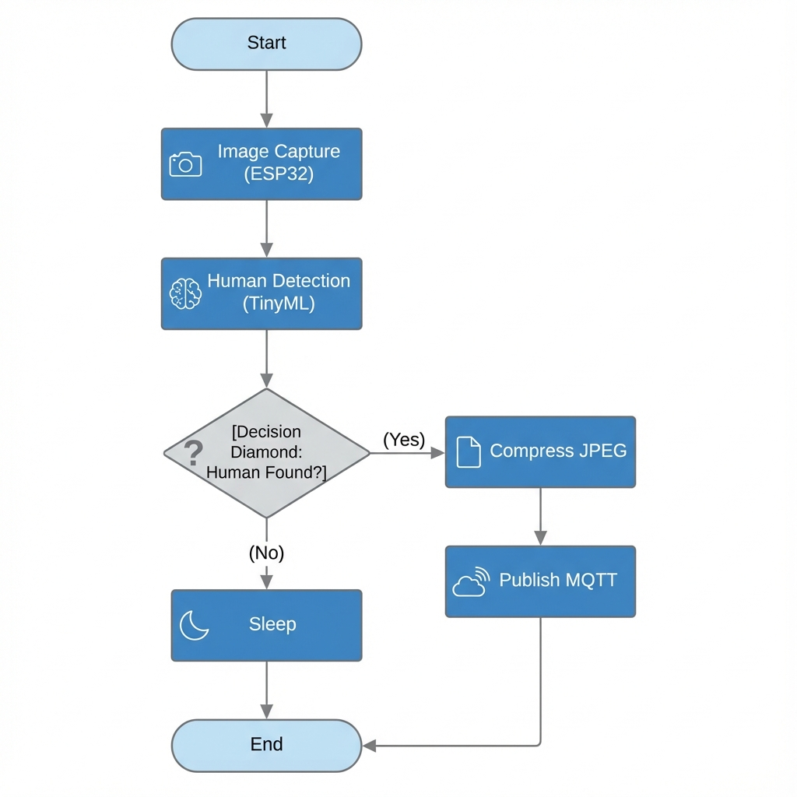

# 🦅 EagleEye: Intelligent Edge AI Surveillance System


**EagleEye** is a decentralized, privacy-focused surveillance system that processes video feeds **on the edge**. Instead of streaming terabytes of raw footage to a central server, EagleEye uses the ESP32-CAM to detect intruders locally using TinyML. Only when a threat is detected is the high-resolution evidence transmitted for logging.

---

## 🧐 The Problem with Traditional CCTV

Traditional "Smart" Cameras face three critical bottlenecks:

1.  **Bandwidth Hogging**: Streaming 24/7 video consumes massive amounts of data, clogging local networks.
2.  **High Latency**: Cloud-based AI analysis introduces delays. Seconds matter when an intruder is at the door.
3.  **Privacy Risks**: Constant uploading of footage to third-party clouds raises significant privacy concerns.

## 💡 The Solution: Edge Computing

EagleEye shifts the intelligence from the cloud to the camera itself.

*   **Zero-Latency Detection**: AI inference runs directly on the ESP32 MCU (240MHz).
*   **Bandwidth Efficient**: Zero data usage until a human is detected.
*   **Privacy First**: No video leaves your premises unless an event occurs.

---

## 🏗️ System Architecture

The system consists of two main components: the **Edge Node** (ESP32-CAM) and the **Central Bridge** (Python).



### 1. The Edge Layer (Firmware)
*   **Hardware**: AI-Thinker ESP32-CAM.
*   **Software**: Arduino C++ with Edge Impulse SDK.
*   **Function**:
    *   Captures low-res frames for continuous inference.
    *   Runs a quantized quantization-aware trained neural network.
    *   Upon positive detection (>80% confidence), captures a high-quality JPEG.
    *   Encodes image to Base64 and publishes to MQTT.

### 2. The Application Layer (Backend)
*   **Software**: Python 3.
*   **Libraries**: `paho-mqtt`, `base64`.
*   **Function**:
    *   Listens to the `eagleeye/camera/image` topic.
    *   Decodes the Base64 payload.
    *   Validates JPEG integrity (Magic Bytes check).
    *   Saves evidence to the local `captures/` directory.

---

## 🚀 Getting Started

### Hardware Requirements
*   ESP32-CAM (AI-Thinker Model)
*   FTDI Programmer (for flashing)
*   5V Power Supply

### Software Prerequisites
*   **Arduino IDE** (with ESP32 Board Manager installed)
*   **Python 3.x**
*   **VS Code** (Recommended)

### 📥 1. Firmware Installation (ESP32)

1.  Open `IOT_Project_FYP_integeration/esp32_camera/esp32_camera.ino` in Arduino IDE.
2.  Install the required library: **EdgeImpulse** (Add the zipped library from the simple folder if needed).
3.  Open `secrets.h` (create it if missing based on headers) and configure your credentials:
    ```cpp
    const char* ssid_iot = "YOUR_WIFI_SSID";
    const char* password_iot = "YOUR_WIFI_PASSWORD";
    const char* mqtt_server_iot = "broker.hivemq.com";
    ```
4.  Select Board: **AI Thinker ESP32-CAM**.
5.  **Upload** the code.

### 🐍 2. Backend Bridge Setup

1.  Navigate to the integration folder:
    ```bash
    cd IOT_Project_FYP_integeration
    ```
2.  Install dependencies:
    ```bash
    pip install paho-mqtt firebase-admin cloudinary python-dotenv
    ```
3.  Run the bridge:
    ```bash
    python bridge.py
    ```

---

## 📸 Snapshots

> *Placeholders for your actual project screenshots*


### System Diagrams

| System Architecture | Logic Flowchart |
| :---: | :---: |
|  |  |


---

## 🔮 Future Roadmap

- [ ] **Face Recognition**: Upgrade model to identify *who* is at the door, not just *that* someone is there.
- [ ] **Mobile App**: React Native app for push notifications.
- [ ] **OTA Updates**: Over-the-air firmware updates for the camera.

---

## 🤝 Contribution

Contributions are welcome! Please fork the repository and submit a pull request.

## 📄 License

MIT License
