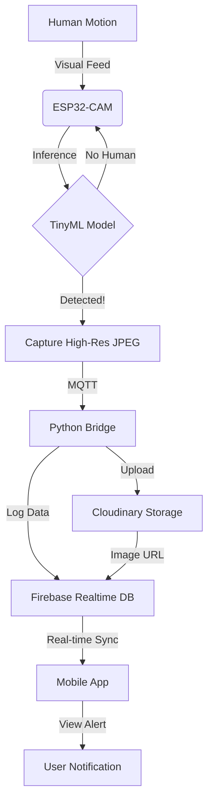

# 🦅 EagleEye: Intelligent Edge AI Surveillance System

[](https://github.com/muhammadAB123/fyp-eagle-eye)
[](https://espressif.com)
[](https://edgeimpulse.com)
[](https://firebase.google.com)
[](https://cloudinary.com)

**EagleEye** is a decentralized, privacy-focused surveillance system that processes video feeds **on the edge**. Using the ESP32-CAM and TinyML, it detects intruders locally and only transmits high-resolution evidence to the cloud when a threat is confirmed.

---

## 🏗️ System Architecture

EagleEye bridges the gap between low-power edge hardware and powerful cloud services.



### 1. The Edge Layer (Firmware)
*   **Hardware**: AI-Thinker ESP32-CAM.
*   **AI Model**: Quantized Neural Network trained via Edge Impulse.
*   **Logic**: Runs continuous low-res inference. Upon detection (>80% accuracy), it captures a high-resolution JPEG and sends it via MQTT.

### 2. The Cloud Gateway (Python Bridge)
*   **Connectivity**: Connects local MQTT broker to the internet.
*   **Cloudinary**: Stores high-resolution images securely and provides optimized delivery URLs.
*   **Firebase**: Acts as the central nervous system, storing timestamps, alert types, and image URLs in a Realtime Database.

### 3. The Mobile Application (React Native)
*   **Real-time Alerts**: Listens to Firebase and updates the UI instantly when an intrusion occurs.
*   **Gallery View**: Browse through historical alerts with high-quality evidence images.
*   **Tech Stack**: Expo, React Native, Firebase SDK.

---

## 🚀 Setting Up the Project

> **Need a quick start?** Check out the [Manual Start Guide](PROJECT_MANUAL_START.md) for step-by-step commands to run the backend components.

### Hardware Prerequisites
*   ESP32-CAM (AI-Thinker)
*   FTDI USB-to-TTL Adapter
*   5V 2A Power Supply

### Software Setup

#### 1. Firmware (ESP32)
1.  Open `IOT_Project_FYP_integeration/esp32_camera/esp32_camera.ino`.
2.  Configure `secrets.h` with your WiFi and MQTT credentials.
3.  Flash using the AI Thinker ESP32-CAM board setting.

#### 2. Backend (Python Bridge)
1.  Enter the integration directory: `cd IOT_Project_FYP_integeration`.
2.  Install dependencies:
    ```bash
    pip install paho-mqtt firebase-admin cloudinary python-dotenv
    ```
3.  Configure `.env` with your Cloudinary and Firebase credentials.
4.  Run the bridge: `python bridge.py`.

#### 3. Mobile App (Expo)
1.  Navigate to `mobile-app`.
2.  Install packages: `npm install`.
3.  Start the app: `npx expo start`.

---

## 📸 Project Gallery

### Mobile App Interface
| Alert List | Image Detail |
| :---: | :---: |
| [Insert App Screenshot 1] | [Insert App Screenshot 2] |

### Hardware Setup
| ESP32-CAM | Edge AI Dashboard |
| :---: | :---: |
| [Insert Hardware Photo] | [Insert Edge Impulse Graph] |

---

## 🛠️ Tech Stack & Credits
*   **Communication**: Local MQTT via Mosquitto Broker (Lightweight IoT messaging)
*   **React Native**: Cross-platform mobile performance.
*   **Image Text**: *"Advanced Tech Stack: Leveraging Local Mosquitto and modern protocols for ultimate system reliability."*

---

## 📄 License
Detailed license information can be found in the [LICENSE](LICENSE) file. Developed as part of a Final Year Project (FYP).
